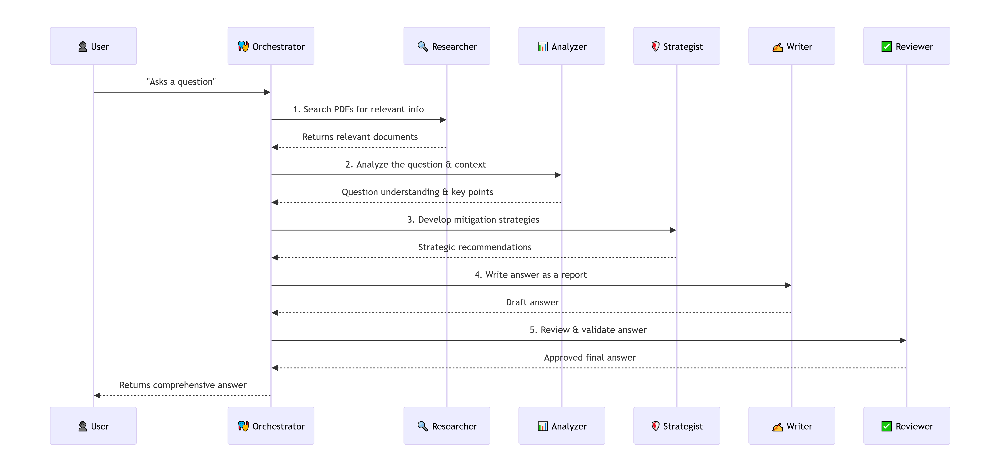
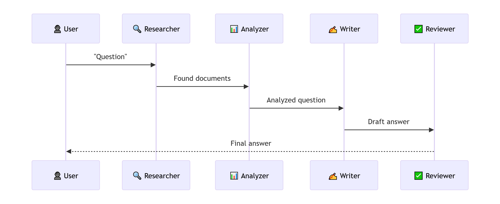
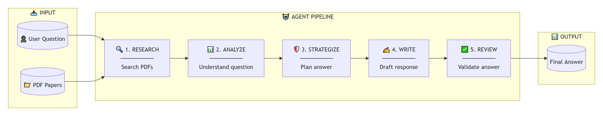

# RiskPaperAnalysisCrew
Multi-agent RAG system that reads and answers questions from risk analysis papers using 5 specialized agents.


## Alternative: If you want the diagrams embedded directly (without external images)

```markdown
## Architecture Diagrams

### Complete System Architecture

 
*Figure 1: Complete multi-agent system architecture*

### Simplified Architecture



*Figure 2: Simplified view of the agent pipeline*

### Flow Diagram



*Figure 2: Data flow through the system*


## Pre-Requisites
### Downloaded Model Checkpoint (Deepseek in our case)
### Papers in PDF

## Run
### python multi_agent_riskanalysis.py
